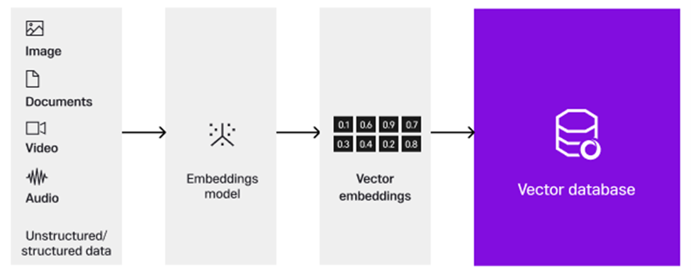
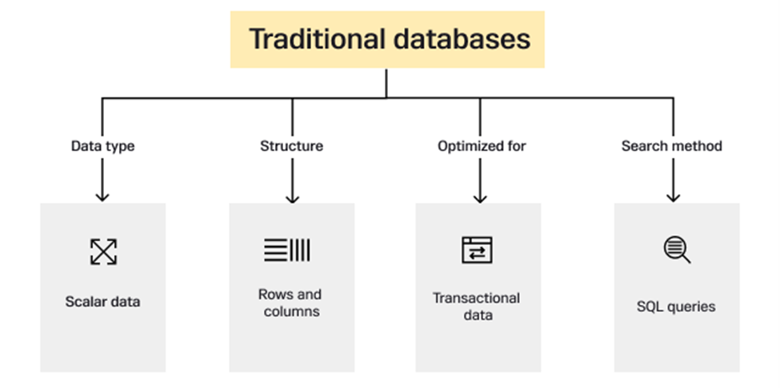
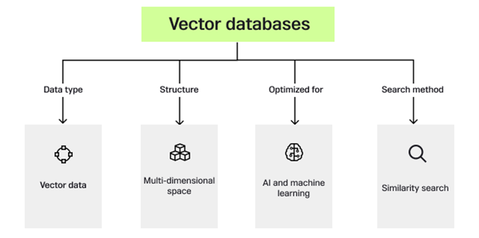
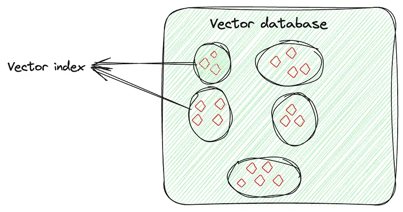
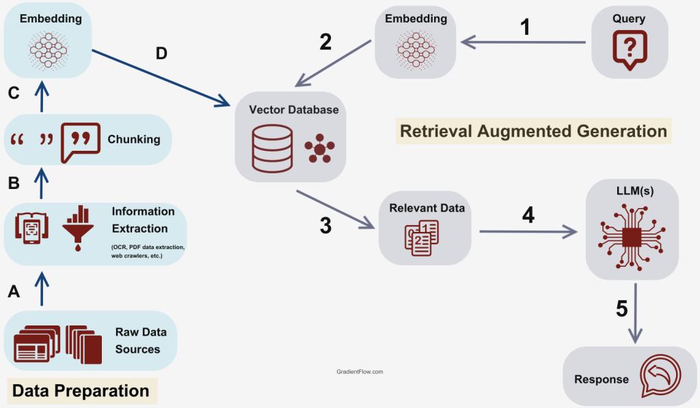

## Concepts

### Vector Database

A vector database is a database that stores information as vectors, which are numerical representations of data objects, also known as vector embeddings

Vector databases are specialized data management systems designed to handle complex, high-dimensional data that is typically represented in vector form. They represent a shift away from traditional databases and have evolved based on the need to store and process data types as vectors.

A core function of vector databases is measuring the similarity between vectors. This is often done using metrics like cosine similarity, Euclidean distance, or Manhattan distance. These metrics help identify how close or similar two data points (vectors) are to one another.

<p align="center">
    
</p>

The architecture of vector databases includes the following:

- *Storage layer*: This layer is responsible for storing vector data. It may use traditional database storage mechanisms but is optimized for vector storage.
- *Indexing layer*: Here, vectors are indexed to allow efficient querying. This layer uses algorithms and data structures suited for high-dimensional data.
- *Query processing layer*: This layer handles the processing of queries. It interprets queries, accesses the appropriate index, and retrieves the relevant vectors.
- *Similarity computation*: This is an integral part of the query processing layer, where the similarity between the query vector and the database vectors is computed.

<p align="center">
    
</p>
<p align="center">
    
</p>


#### Types of vector databases
Vector databases can be classified in various ways, including the data types they handle, indexing techniques, storage models, and architectures.

##### Categorization based on data type
- *Text vector databases*: These databases are optimized for storing and querying vector representations of text data and are often used in natural language processing tasks.
- *Image vector databases*: Designed for image data, these databases store vectors representing images and are useful in applications like image retrieval or analysis.
- *Multimedia vector databases*: Capable of handling various types of media, including video, audio, and images, these databases are often employed in multimedia content management.
- *Graph vector databases*: Specialized in storing vector representations of graph data, these are useful in social network analysis and recommendation systems.

##### Categorization based on indexing technique
- *Tree-based indexing databases*: These utilize tree structures like KD-trees or R-trees for indexing, which is suitable for datasets where tree-based partitioning is effective.
- *Hashing-based indexing databases*: This type employs hashing techniques for faster retrieval—particularly effective in very large datasets.
- *Quantization-based databases*: This method uses vector quantization for indexing, balancing memory usage, and retrieval accuracy.

##### Categorization based on the storage model
- *In-memory databases*: These databases store all data in RAM; they offer very fast data retrieval but are limited by memory constraints.
- *Disk-based databases*: These store data on disk, making them suitable for larger datasets, but they have slower retrieval times than in-memory solutions.
- *Hybrid databases*: This approach combines in-memory and disk-based approaches, balancing speed and storage capacity.

##### Categorization based on architecture
- *Distributed vector databases*: These databases are designed to run on multiple nodes, distributing the data across different machines. This model is important for handling very large datasets and provides scalability and fault tolerance. Distributed databases can handle massive volumes of data and high query loads, making them suitable for large-scale applications in enterprise and research environments.
- *Single-node vector databases*: Well-suited for smaller-scale applications, these databases operate on a single machine. They are easier to set up and manage but are limited by the hardware capabilities of the single node.
- *Cloud-based vector databases*: These databases are offered as a service by cloud providers and leverage cloud infrastructure for scalability and flexibility. Users can scale their database usage up or down based on their needs without managing physical hardware.
- *GPU-accelerated vector databases*: These utilize the processing power of GPUs to accelerate data retrieval and similarity search operations. They are particularly effective for computation-intensive tasks like deep learning model inferences or high-speed similarity searches.


#### Use cases for vector databases
Use cases of vector database applications can be seen by looking at semantic search engines. Traditional search engines rely primarily on keyword matching, which can often miss the semantic meaning of queries. Vector databases enable a semantic search approach by converting text into high-dimensional vectors that capture the semantic essence of the text, allowing search engines to return results that are semantically similar to the query even if they don’t contain the exact keywords.

Vector databases are also applicable in the context of recommender systems. These systems often handle high-dimensional data and need to find similar items within a large dataset. Vector databases use approximate nearest neighbor (ANN) search to identify similar items quickly, which is particularly beneficial for recommendation systems where the goal is to suggest items similar to ones the user has shown interest in previously. Companies like Netflix and Amazon use vector databases to improve their recommendation systems, leading to more personalized and precise suggestions.

Another area where vector databases are increasingly used is with large language models (LLMs) like GPT-3 and BERT. These models generate high-dimensional vector representations of text that need to be stored and retrieved efficiently. Vector databases are ideally suited for this task as they are designed to handle high-dimensional data and support efficient similarity search. This capability enables companies to leverage LLMs for various applications, including chatbots, sentiment analysis, and text classification. 

Furthermore, this extends to Retrieval-Augmented Generative (RAG) models, where the benefits of incorporating them into vector databases include enhanced context preservation, increased trustworthiness, and improved performance. This integration facilitates a more sophisticated understanding of language nuances and context, contributing to the effectiveness of applications relying on these advanced language models.


### Vector Index

Vector indexing is not just about storing data, it’s about intelligently organizing the vector embeddings to optimize the retrieval process. This technique involves advanced algorithms to neatly arrange the high-dimensional vectors in a searchable and efficient manner. This arrangement is not random; it’s done in a way that similar vectors are grouped together, by which vector indexing allows quick and accurate similarity searches and pattern identification, especially for searching large and complex datasets.

<p align="center">
    
</p>

Let’s say you have a vector for each image, capturing its features. The vector index will organize these vectors in a way that makes it easier to find similar images (here). You can think of it as if you are organizing each person’s images separately. So, if you need a specific person’s picture from a particular event, instead of searching through all the pictures, you would only go through that person’s collection and easily find the image.


#### Open Source Options

- [Milvus](https://milvus.io/docs)
- [Weaviate](https://weaviate.io/)
- [Faiss](https://github.com/facebookresearch/faiss)
- [Chromadb](https://www.trychroma.com/)

### Embedding Models

Embedding models are models that are trained specifically to generate vector embeddings: long arrays of numbers that represent semantic meaning for a given sequence of text:

<p align="center">
    
</p>

The resulting vector embedding arrays can then be stored in a database, which will compare them as a way to search for data that is similar in meaning.
Specialized databases used to store these embedding vectors are known as vector databases. These databases take advantage of the mathematical properties of embeddings that allow similar items to be stored together. Different techniques are used to store similar vectors together and dissimilar vectors apart. They are vector indexing techniques.

### RAG (Retrieval Augmented Generation)
RAG is a technique for augmenting LLM knowledge with additional data.

RAG is a framework for improving model performance by augmenting prompts with relevant data outside the foundational model, grounding LLM responses on real, trustworthy information. Users can easily “drag and drop” their company documents into a vector database, enabling a LLM to answer questions about these documents efficiently.

A typical RAG process, as pictured below, has an LLM, a collection of enterprise documents, and supporting infrastructure to improve information retrieval and answer construction. The RAG pipeline looks at the database for concepts and data that seem similar to the question being asked, extracts the data from a vector database and reformulates the data into an answer that is tailored to the question asked. This makes RAG a powerful tool for companies looking to harness their existing data repositories for enhanced decision-making and information access.
<p align="center">
    
</p>


A typical RAG application has two main components:

- *Indexing*: a pipeline for ingesting data from a source and indexing it. This usually happens offline.
- *Retrieval and generation*: the actual RAG chain, which takes the user query at run time and retrieves the relevant data from the index, then passes that to the model.

The most common full sequence from raw data to answer looks like:

#### Indexing
- *Load*: First we need to load our data. This is done with Document Loaders.
- *Split*: Text splitters break large Documents into smaller chunks. This is useful both for indexing data and for passing it in to a model, since large chunks are harder to search over and won't fit in a model's finite context window.
- *Store*: We need somewhere to store and index our splits, so that they can later be searched over. This is often done using a VectorStore and Embeddings model.

<p align="center">
    
</p>

#### Retrieval and generation
- *Retrieve*: Given a user input, relevant splits are retrieved from storage using a Retriever.
- *Generate*: A ChatModel / LLM produces an answer using a prompt that includes the question and the retrieved data

<p align="center">
    
</p>


### LangChain
LangChain is a framework for developing applications powered by large language models (LLMs). LangChain provides tools and abstractions to improve the customization, accuracy, and relevancy of the information the models generate. For example, developers can use LangChain components to build new prompt chains or customize existing templates. LangChain also includes components that allow LLMs to access new data sets without retraining.

#### LangSmith
Many of the applications you build with LangChain will contain multiple steps with multiple invocations of LLM calls. As these applications get more and more complex, it becomes crucial to be able to inspect what exactly is going on inside your chain or agent. The best way to do this is with LangSmith.

## Ollama locally

### Download models

```bash
ollama pull all-minilm
ollama pull llama3.1:8b
```


```bash
curl http://localhost:11434/api/generate -d '{"model": "llama3.1:8b","prompt":"What is a vector database?", "stream": false }'

# remote
curl http://192.168.0.12:11434/api/generate -d '{"model": "llama3.1:8b","prompt":"What is a vector database?", "stream": false }'
```

## References
- [Vector Databases](https://nexla.com/ai-infrastructure/vector-databases/)
- [Embedding Models](https://ollama.com/blog/embedding-models)
- [Jupyter Notebook example](https://github.com/weaviate/recipes/blob/main/weaviate-features/generative-search/local_rag_using_ollama_integration_using_embedded.ipynb) 
- [LangChain](https://python.langchain.com/v0.2/docs/introduction/) 
- [Vector Indexing](https://medium.com/@myscale/understanding-vector-indexing-a-comprehensive-guide-d1abe36ccd3c)
- [Introduction to RAG](https://medium.com/enterprise-rag/an-introduction-to-rag-and-simple-complex-rag-9c3aa9bd017b)
- [Creating a RAG with LangChain](https://python.langchain.com/v0.2/docs/tutorials/rag/)
